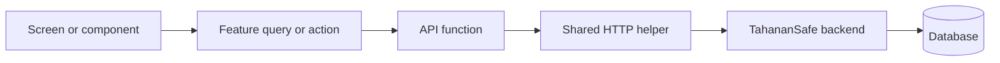

# TahananSafe Mobile Architecture Guide

This guide explains how the mobile app is organized and where new code should go. It is written for developers who are still getting familiar with React Native, Expo, and this project.

## Start here

TahananSafe Mobile is one Expo/React Native app. The code is grouped by feature, such as reports, messages, notifications, and community posts.

Most data follows this path:



In plain language:

1. A screen displays information or handles user input.
2. Feature code loads or changes data for that screen.
3. An API function describes the backend request.
4. The shared HTTP helper adds the user's token and handles login-session problems.
5. The backend validates the request and reads or updates the database.

This structure keeps features separate while allowing them to share common code. We do not need a separate mobile app or service for every feature.

## What is already in place

The first architecture improvements have already been added:

- `src/app/AppProviders.tsx` sets up services used across the app, including safe-area support, data caching, app lifecycle handling, themes, authentication, and alerts.
- `src/app/queryClient.ts` controls how data from the server is cached. Report lists and report details now share reusable cache keys.
- `src/app/MobileLifecycle.tsx` tells the data cache when the app returns to the foreground or reconnects to the internet. This allows old data to be refreshed.
- `src/api/http.ts` is the shared helper for authenticated backend requests. It adds access tokens, refreshes an expired session once, and retries the original request once.
- `src/auth/AuthContext.tsx` stores the signed-in user's identity. Logging out or losing the session also clears cached user data.
- The signed-in area has one 15-minute inactivity timer. It locks with the resident's PIN when a PIN exists, or logs the user out when it does not. Time spent in the background also counts.
- A report is saved before AI analysis starts. Users do not have to wait for AI before their report is accepted.
- Report evidence is loaded through protected mobile endpoints, so the backend can check who is requesting it.
- Mobile requests use a token in the `Authorization` header. The backend still validates that token, while browser-only cookie security checks remain separate.

To check for TypeScript errors, run:

```bash
npm run typecheck
```

## Folder guide

Use this map when deciding where new code belongs:

```text
src/
  app/                 app-wide setup, lifecycle, data cache, and navigation
  features/
    reports/           loading, updating, and displaying report data
    messaging/         message data and actions
    notifications/     notification data and actions
    community/         community post data and actions
    incidents/         report draft and submission steps
  api/                 functions that call backend endpoints
  auth/                login session, tokens, and signed-in user state
  components/          reusable UI pieces used in more than one place
  screens/             full pages connected to navigation
  theme/               colors, text styles, spacing, and theme settings
  utils/               small reusable helper functions
```

The usual direction is:

```text
screen/component -> feature -> API -> shared HTTP/session code -> backend
```

Keep these rules in mind:

- Screens and components may use feature code.
- Feature code may use API functions and shared UI.
- API code must not import a screen or UI component.
- One feature should not directly change another feature's private screen state.

### Quick examples

- A reusable button belongs in `src/components`.
- Code that loads a report list belongs in `src/features/reports`.
- The function that calls the report endpoint belongs in `src/api`.
- A helper that formats a date and has no app state belongs in `src/utils`.
- A full page opened by navigation belongs in `src/screens`.

## Where state belongs

"State" means information that can change while the app is running. Put each kind of state in the smallest suitable place.

| Kind of state | Where it belongs | Examples |
|---|---|---|
| Temporary UI state | The component or screen | open modal, search text, selected tab |
| Data from the backend | TanStack Query | reports, notifications, community posts |
| Login state | `AuthContext` and secure storage | signed-in user, access token, refresh token |
| App-wide preferences | A small focused context or settings module | theme, app-lock preference |
| Sensitive unfinished reports | An encrypted local store in a future update | report text and evidence waiting to upload |

Do not copy backend data into a large global context. Let TanStack Query store it. After saving a change, refresh only the related cached data.

For example, after editing a report, refresh that report's details and any report list that displays it. There is no need to refresh unrelated community posts.

## API and login rules

Follow these rules whenever a feature talks to the backend:

1. Call a function from `src/api`; do not call `fetch` directly from a screen.
2. Authenticated API functions must use `requestJson` or `requestRaw` from `src/api/http.ts`.
3. Only the shared HTTP helper may refresh login tokens. Do not add token-refresh loops to screens.
4. After refreshing a token, retry a failed request only once. Never create an endless retry loop.
5. When logout happens or the session can no longer be refreshed, delete the tokens and clear cached user data.
6. Before returning report evidence, the backend must check the signed-in user and confirm that the user owns the report or has official access.
7. Official mobile endpoints currently use some `/api/web/v1` routes. They should later move to `/api/mobile/official/v1`. Until then, those routes must continue to accept and validate mobile tokens.

## Report submission and AI

Saving a safety report is more important than waiting for AI. The expected flow is:

```text
Resident submits a report
          |
          v
Backend checks and saves the report and evidence
          |
          +----> The app receives success
          |
          v
AI work is placed in a background queue
          |
          v
A worker saves the AI result later
```

If AI is slow or unavailable, the report must still be accepted. The report detail screen may show one of these AI states:

- `pending`: waiting to start
- `processing`: currently being analyzed
- `retrying`: another analysis attempt will be made
- `completed`: analysis finished
- `failed`: analysis could not finish
- `skipped`: analysis was intentionally not run

The app may refresh report details to get the latest state. It must not repeatedly run AI analysis before accepting the report. Officials make the final decisions even when AI results are available.

## Navigation plan

The top-level login flow already uses React Navigation. Some resident and official pages still switch views manually. Move them to React Navigation in small steps:

1. List the allowed route names and route parameters for resident and official users using TypeScript types.
2. Move the main resident sections into a bottom-tab navigator.
3. Add nested stacks for report details, report creation, settings, and messaging.
4. Create a separate official navigator for the dashboard, reports, messaging, and settings.
5. Let notifications open a page using a stable ID, such as a report ID. Do not pass an entire report object through navigation.

Avoid deeply nested navigators. Navigation parameters should contain IDs and small options. Load the full record with TanStack Query on the destination screen.

## Offline behavior and retries

The app may cache read-only backend data. It must not save sensitive report details in plain AsyncStorage.

Submitting reports later while offline is a future improvement. Before adding it, the app and backend need:

- encrypted storage for report text and evidence information;
- private, durable copies of selected photos or files, because temporary file links can disappear;
- a unique ID such as `clientSubmissionId`, so retrying the same upload does not create a duplicate report;
- clear `queued`, `uploading`, `submitted`, and `failed` states;
- buttons that let the user retry or delete a queued report;
- cleanup of locally saved data after a successful upload or logout.

Until the backend can detect duplicate submissions, do not automatically retry report creation. Otherwise one emergency report could be submitted more than once.

## Realtime messaging

For now, regular checks for new messages are the reliable option. Keep this behavior until the backend can send events when a message is created, updated, or deleted.

If Socket.IO is added later:

- keep its code inside `features/messaging`;
- connect only to report conversations the user is allowed to access;
- refresh the related message cache when an event arrives;
- return to regular checks when the socket disconnects;
- continue treating backend API data as the final correct version.

## Test checklist

Every change should pass these basic checks:

- Run `npm run typecheck`.
- Test login, token refresh, logout, and a rejected refresh token.
- Confirm the app locks after 15 minutes of use without activity.
- Confirm 15 minutes in the background also causes a lock or logout.
- Confirm report submission succeeds when AI or Redis is unavailable.
- Confirm residents can view only evidence for their own reports.
- Confirm official evidence access follows backend permissions.
- Confirm report lists and details refresh after a change, internet reconnection, or returning to the app.
- Confirm residents cannot open official pages and that the backend blocks official-only actions.

Start automated tests with small helpers that convert data or labels. Next, test shared behavior such as token refresh and cache updates. Use device-level tests for PIN locks and background behavior because mobile timers work differently across platforms.

## Android and iOS settings

This repository stores the native `android/` and `ios/` projects, but it also contains native settings and plugins in `app.json`. A change in `app.json` may not be copied automatically into the native projects.

The team should choose one approach and use it consistently:

- Let Expo regenerate the native projects through a reviewed prebuild process; or
- Treat `android/` and `ios/` as the main versions and apply the same settings to them manually.

Until the team chooses, review the native projects after every plugin or native `app.json` change, then test it with a development build.

## Roadmap

### Phase 1 — completed

- Set up app-wide providers and lifecycle handling.
- Centralize authenticated requests and token refresh.
- Add the query cache and shared report query keys.
- Add the inactivity lock/logout behavior.
- Allow reports to succeed before AI finishes.
- Use protected mobile URLs for report evidence.

### Phase 2 — recommended next

- Move notification, community, admin, and messaging data loading into their feature folders.
- Replace manual resident and official view switching with typed navigators.
- Break very large screens into smaller components and reusable hooks.
- Add dedicated official mobile API routes.
- Add automated tests for token refresh and app locking.

### Phase 3 — needs backend and secure-storage support

- Add encrypted report drafts and safe offline submission.
- Add complete live-message events, with regular checking as a backup.
- Save non-sensitive cached data between app launches while keeping each user's cache separate.
- Add monitoring for API errors, delayed background jobs, crashes, and release health.

## Adding packages

Add a new package only when it solves a clear project need or removes repeated code.

TanStack Query and NetInfo are used because many features need shared caching, request deduplication, reconnection handling, and data refreshing. Add realtime or offline-storage packages only after the matching backend and security requirements are ready.

## Small glossary

- **API:** the endpoints the mobile app uses to communicate with the backend.
- **Backend:** the server that checks requests, applies permissions, and works with stored data.
- **Cache:** a local copy of backend data used to avoid unnecessary requests and show data faster.
- **Feature:** one area of the app, such as reports or messaging.
- **Mutation:** an action that creates, edits, or deletes backend data.
- **Query:** a request that reads backend data.
- **Token refresh:** replacing an expired access token so a valid login session can continue.
- **Worker:** a backend process that handles slower jobs, such as AI analysis, outside the main report request.

## Helpful references

- [React Navigation authentication flows](https://reactnavigation.org/docs/auth-flow/)
- [React Navigation navigator nesting](https://reactnavigation.org/docs/nesting-navigators/)
- [TanStack Query with React Native](https://tanstack.com/query/latest/docs/framework/react/react-native)
- [Expo SecureStore](https://docs.expo.dev/versions/latest/sdk/securestore/)
- [Expo SQLite](https://docs.expo.dev/versions/latest/sdk/sqlite/)
